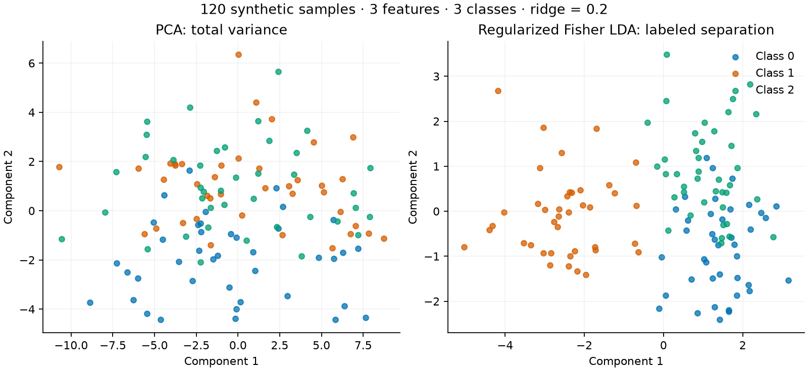

# Differentiable Fisher LDA in JAX: from generalized eigh to an ML example

[English](generalized-eigh-lda.md) · [Русский](generalized-eigh-lda-ru.md)

I contributed generalized Hermitian eigenproblems to JAX: first [type 1](https://github.com/jax-ml/jax/pull/41162), then [types 2 and 3](https://github.com/jax-ml/jax/pull/41197). Both PRs are merged. This article applies type 1 to regularized Fisher linear discriminant analysis (LDA), then differentiates a spectral objective with respect to regularization and a feature scale.

The [executable example](../examples/differentiable_lda.py) includes an independent NumPy/SciPy reference and checks for `jit`, `vmap` and gradients. The [upstream case study](../case-studies/generalized-eigh.md) explains the solver implementation. A [45-minute workshop worksheet](../workshops/fisher-lda.md) is available for self-study or a future session; I have not delivered that session.

## A small supervised dimensionality-reduction problem

The fixture has 120 synthetic samples, three classes and three features. The third feature has substantial noise variance but no separation between the generating class means. This makes the difference between PCA's total-variance criterion and LDA's label-aware criterion visible.



Both projections use the same data, without a held-out set. The picture illustrates objectives, not classification accuracy or generalization. An [SVG version](assets/fisher-lda.svg) is available.

For each class, let $n_c$ be its sample count, $\mu_c$ its mean and $\mu$ the overall mean. I construct

$$
S_W = \frac{1}{N}\sum_c\sum_{i:y_i=c}(x_i-\mu_c)(x_i-\mu_c)^T,
\qquad
S_B = \frac{1}{N}\sum_c n_c(\mu_c-\mu)(\mu_c-\mu)^T.
$$

The goal is to find directions with large between-class variation relative to within-class variation. [Scikit-learn's LDA documentation](https://scikit-learn.org/stable/modules/lda_qda.html) explains the supervised dimensionality-reduction interpretation. With three classes, $S_B$ has rank at most two; I retain two leading directions.

Ridge regularization gives a positive-definite metric:

$$
B = S_W + \alpha I,\qquad \alpha>0.
$$

Stationary directions of the Rayleigh quotient $v^T S_Bv/(v^TBv)$ satisfy the type-1 generalized eigenproblem:

$$
S_Bv = \lambda Bv.
$$

The numerical core is:

```python
within, between = scatter_matrices(x, labels)
metric = within + ridge * jnp.eye(x.shape[1], dtype=x.dtype)
values, vectors = jax.scipy.linalg.eigh(between, metric, type=1)
projection = (x - x.mean(axis=0)) @ vectors[:, -2:]
```

`eigh` sorts eigenvalues in ascending order, so the last two columns are the leading directions. The plot reverses those two columns to show the largest-eigenvalue component first.

## Why not call ordinary eigh on an inverse product?

Multiplying by $B^{-1}$ gives an equivalent eigenvalue equation, but $B^{-1}S_B$ is generally not symmetric. Symmetry of $B$ and $S_B$ separately does not imply symmetry of their product. Passing that product to an ordinary Hermitian eigensolver can therefore change the problem.

The implementation uses $B=LL^T$ and triangular solves to form the symmetric reduction $L^{-1}S_BL^{-T}$. After solving that problem, it maps eigenvectors back with $L^{-T}$. This also gives the correct metric normalization:

$$
V^TBV=I.
$$

I check that identity, not $V^TV=I$. The independent reference is [`scipy.linalg.eigh`](https://docs.scipy.org/doc/scipy/reference/generated/scipy.linalg.eigh.html), using the same type-1 equation. I compare eigenvalues, equation residuals and normalization rather than individual eigenvector entries, whose signs may differ.

## Differentiating through both matrices

The example uses parameters $\theta=\log\alpha$ and $\phi=\log s$, where $s$ scales the first feature. Exponentiation keeps both positive. After changing the feature scale, I recompute both scatter matrices.

For a teaching example, define

$$
J(\theta,\phi)=\sum_{k\in\text{two leading components}}\log(1+\lambda_k(\theta,\phi)).
$$

`jax.jit(jax.value_and_grad(score))` calculates the value and both derivatives. A separate NumPy class loop and SciPy eigensolver calculate central finite differences. The scale derivative exercises changes in both matrices, rather than only the identity regularizer.

This objective demonstrates differentiable spectral computation. It is not a recommendation to select a real model's hyperparameters without held-out validation.

## Executed checks and limitations

The example checks eager and JIT solutions, a `jit(vmap(...))` regularization sweep, SciPy eigenvalue agreement, the defining equation, metric normalization and both gradient components. On 3 October 2026 I reran both modes on Windows CPU, Python 3.12.10, jaxlib 0.11.2, NumPy 2.5.3 and SciPy 1.18.1, with JAX source pinned to `15998e8040d07995ac5dcc4643333e1b88e8c047`. Both runs passed; their actual output is recorded for [x64 off](../validation/differentiable-lda-2026-10-03-x32.json) and [x64 on](../validation/differentiable-lda-2026-10-03-x64.json).

The previously recorded [float32](../validation/differentiable-lda-x32.json) and [float64](../validation/differentiable-lda-x64.json) measurements are:

| Precision | Maximum relative equation residual | Maximum absolute gradient difference from SciPy finite differences |
| --- | --- | --- |
| float32 | $1.43\cdot10^{-7}$ | $5.43\cdot10^{-7}$ |
| float64 | $2.54\cdot10^{-16}$ | $2.49\cdot10^{-11}$ |

The residual is $\|S_BV-BV\Lambda\|_F/(\|S_BV\|_F+\|BV\Lambda\|_F)$, taking the maximum over eager and JIT. The finite-difference step is $10^{-5}$; this reference has numerical error and is not an exact derivative. [CI](https://github.com/jabrailkhalil/jax-reliability-notes/actions/workflows/reproduce.yml) runs the same checks and figure generation.

I have not executed this lab on GPU or TPU. The synthetic fixture has separated eigenvalues. It does not explore eigenvector derivatives at repeated eigenvalues or ill-conditioned matrices, and the code is a three-class exercise rather than a general-purpose LDA classifier.

## Reproduce the lab

Pinning source matters: a merged PR does not by itself establish that an installed release contains it.

```sh
git clone https://github.com/jabrailkhalil/jax-reliability-notes.git
cd jax-reliability-notes
python -m venv .venv
```

Use Python 3.12. Activate with `source .venv/bin/activate` on Linux/macOS or `.\.venv\Scripts\Activate.ps1` in PowerShell, then run:

```sh
git clone --filter=blob:none https://github.com/jax-ml/jax.git .lab/generalized-jax
git -C .lab/generalized-jax checkout 15998e8040d07995ac5dcc4643333e1b88e8c047
python -m pip install -r requirements-lda.txt .lab/generalized-jax
python examples/differentiable_lda.py
python examples/differentiable_lda.py --x64 --plot-dir .lab/lda-plot
```

The script prints dependency versions and measured results, and exits with an error if its checks disagree with the reference. The optional figure is written to the separate lab directory, leaving the published illustration unchanged.
